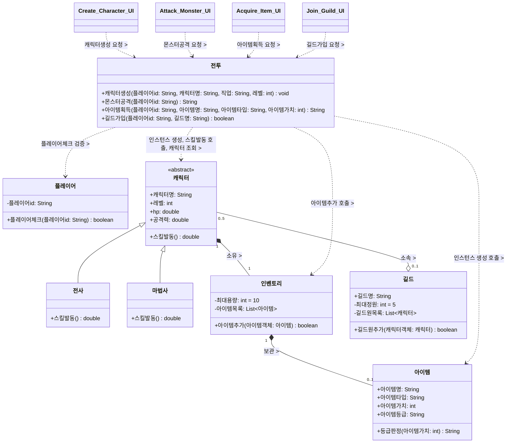

```mermaid
classDiagram
    direction ISO

    %% UI Boundary Classes (Phase 1 & 2)
    class Create_Character_UI {

    }

    class Attack_Monster_UI {

    }

    class Acquire_Item_UI {

    }

    class Join_Guild_UI {

    }

    %% Control Class (요구사항 반영: 행위로 캐릭터생성, 몬스터공격, 아이템획득, 길드가입 포함)
    class 전투 {
        +캐릭터생성(플레이어id: String, 캐릭터명: String, 직업: String, 레벨: int) void
        +몬스터공격(플레이어id: String) String
        +아이템획득(플레이어id: String, 아이템명: String, 아이템타입: String, 아이템가치: int) String
        +길드가입(플레이어id: String, 길드명: String) boolean
    }

    %% Domain Classes (Phase 1)
    class 플레이어 {
        -플레이어id: String
        +플레이어체크(플레이어id: String) boolean
    }

    %% Phase 1 캐릭터 (추상)
    class 캐릭터 {
        <<abstract>>
        +캐릭터명: String
        +레벨: int
        +hp: double
        +공격력: double
        +스킬발동() double
    }

    class 전사 {
        +스킬발동() double
    }

    class 마법사 {
        +스킬발동() double
    }

    %% Domain Classes (Phase 2 - Composite Objects)
    
    %% Composition: 캐릭터 생성 시 함께 생성, 최대 용량 10칸 제한
    class 인벤토리 {
        -최대용량: int = 10
        -아이템목록: List<아이템>
        +아이템추가(아이템객체: 아이템) boolean
    }

    %% Composition: 인벤토리 삭제 시 함께 삭제됨
    class 아이템 {
        +아이템명: String
        +아이템타입: String
        +아이템가치: int
        +아이템등급: String
        +등급판정(아이템가치: int) String
    }

    %% Aggregation: 길드 해체 시에도 캐릭터는 존재 (정원 5명)
    class 길드 {
        +길드명: String
        -최대정원: int = 5
        -길드원목록: List<캐릭터>
        +길드원추가(캐릭터객체: 캐릭터) boolean
    }

    %% Relationships

    %% 1. 상속 및 소유 관계 (플레이어의 캐릭터 소유 관계 제거)
    캐릭터 <|-- 전사
    캐릭터 <|-- 마법사

    %% 2. 복합객체 관계 (Phase 2 - 핵심 요구사항 반영)
    %% 캐릭터 ◆--- 인벤토리 (Composition)
    캐릭터 "1" *-- "1" 인벤토리 : 소유 >
    %% 인벤토리 ◆--- 아이템 (Composition)
    인벤토리 "1" *-- "0..10" 아이템 : 보관 >
    
    %% 캐릭터 --o 길드 (Aggregation 방향 직접 지정)
    캐릭터 "0..5" --o "0..1" 길드 : 소속 >

    %% 3. UI와 전투 클래스의 상호작용
    Create_Character_UI ..> 전투 : 캐릭터생성 요청 >
    Attack_Monster_UI ..> 전투 : 몬스터공격 요청 >
    Acquire_Item_UI ..> 전투 : 아이템획득 요청 >
    Join_Guild_UI ..> 전투 : 길드가입 요청 >

    %% 4. 전투 클래스의 비즈니스 로직 처리 (Include 및 연산 수반)
    전투 ..> 플레이어 : 플레이어체크 검증 >
    
    %% 전투 --> 캐릭터 (의존/호출 방향성 직접 지정)
    전투 ..> 캐릭터 : 인스턴스 생성, 스킬발동 호출, 캐릭터 조회 >
    
    전투 ..> 인벤토리 : 아이템추가 호출 >
    전투 ..> 아이템 : 인스턴스 생성 호출 >
    
```
