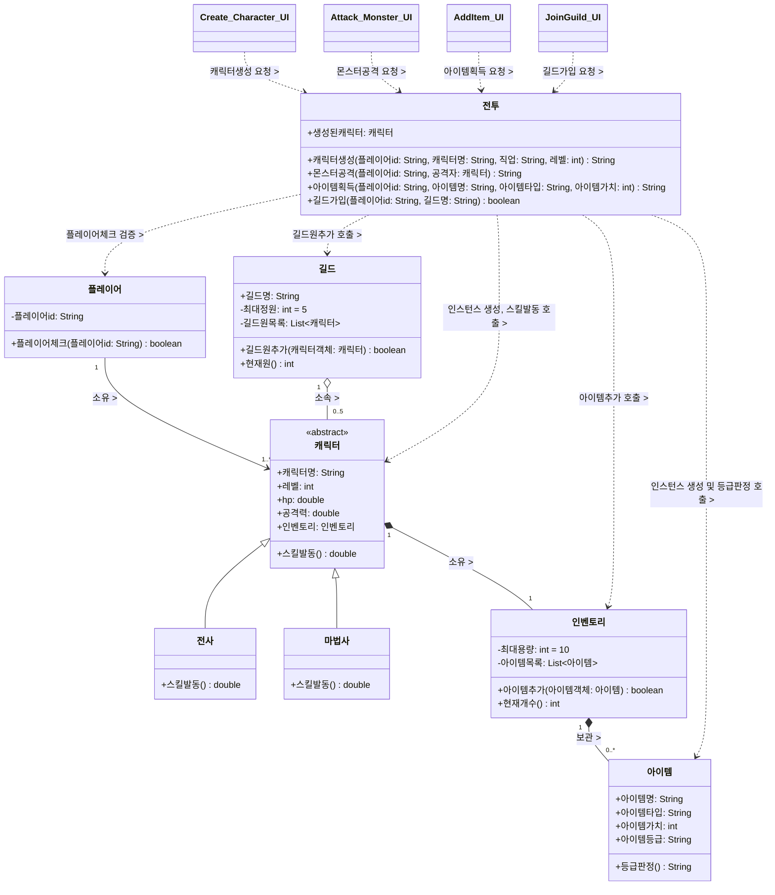

```mermaid
classDiagram
    direction ISO
    %% UI Boundary Classes
    class Create_Character_UI {
    }
    class Attack_Monster_UI {
    }
    class AddItem_UI {
    }
    class JoinGuild_UI {
    }

    %% Control Class
    class 전투 {
        +생성된캐릭터: 캐릭터
        +캐릭터생성(플레이어id: String, 캐릭터명: String, 직업: String, 레벨: int) String
        +몬스터공격(플레이어id: String, 공격자: 캐릭터) String
        +아이템획득(플레이어id: String, 아이템명: String, 아이템타입: String, 아이템가치: int) String
        +길드가입(플레이어id: String, 길드명: String) boolean
    }

    %% Domain Classes
    class 플레이어 {
        -플레이어id: String
        +플레이어체크(플레이어id: String) boolean
    }

    class 캐릭터 {
        <<abstract>>
        +캐릭터명: String
        +레벨: int
        +hp: double
        +공격력: double
        +인벤토리: 인벤토리
        +스킬발동() double
    }
    class 전사 {
        +스킬발동() double
    }
    class 마법사 {
        +스킬발동() double
    }

    class 인벤토리 {
        -최대용량: int = 10
        -아이템목록: List~아이템~
        +아이템추가(아이템객체: 아이템) boolean
        +현재개수() int
    }

    class 아이템 {
        +아이템명: String
        +아이템타입: String
        +아이템가치: int
        +아이템등급: String
        +등급판정() String
    }

    class 길드 {
        +길드명: String
        -최대정원: int = 5
        -길드원목록: List~캐릭터~
        +길드원추가(캐릭터객체: 캐릭터) boolean
        +현재원() int
    }

    %% Relationships
    캐릭터 <|-- 전사
    캐릭터 <|-- 마법사
    플레이어 "1" --> "1..*" 캐릭터 : 소유 >
    캐릭터 "1" *-- "1" 인벤토리 : 소유 >
    인벤토리 "1" *-- "0..*" 아이템 : 보관 >
    길드 "1" o-- "0..5" 캐릭터 : 소속 >

    Create_Character_UI ..> 전투 : 캐릭터생성 요청 >
    Attack_Monster_UI ..> 전투 : 몬스터공격 요청 >
    AddItem_UI ..> 전투 : 아이템획득 요청 >
    JoinGuild_UI ..> 전투 : 길드가입 요청 >

    전투 ..> 플레이어 : 플레이어체크 검증 >
    전투 ..> 캐릭터 : 인스턴스 생성, 스킬발동 호출 >
    전투 ..> 인벤토리 : 아이템추가 호출 >
    전투 ..> 아이템 : 인스턴스 생성 및 등급판정 호출 >
    전투 ..> 길드 : 길드원추가 호출 >
```
