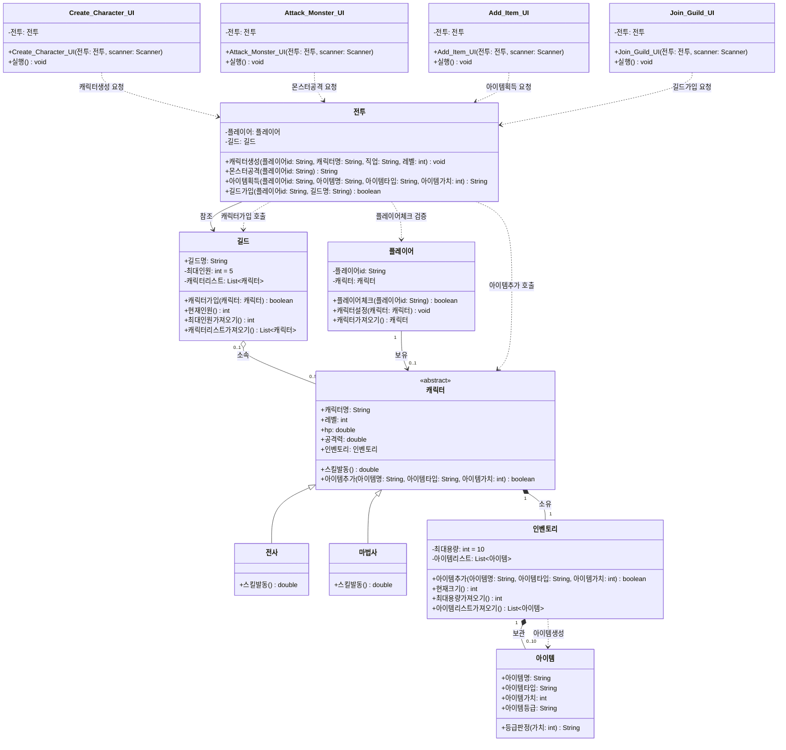

```mermaid
classDiagram
    direction TB

    class Create_Character_UI {
        -전투: 전투
        +Create_Character_UI(전투: 전투, scanner: Scanner)
        +실행() void
    }
    class Attack_Monster_UI {
        -전투: 전투
        +Attack_Monster_UI(전투: 전투, scanner: Scanner)
        +실행() void
    }
    class Add_Item_UI {
        -전투: 전투
        +Add_Item_UI(전투: 전투, scanner: Scanner)
        +실행() void
    }
    class Join_Guild_UI {
        -전투: 전투
        +Join_Guild_UI(전투: 전투, scanner: Scanner)
        +실행() void
    }

    class 전투 {
        -플레이어: 플레이어
        -길드: 길드
        +캐릭터생성(플레이어id: String, 캐릭터명: String, 직업: String, 레벨: int) void
        +몬스터공격(플레이어id: String) String
        +아이템획득(플레이어id: String, 아이템명: String, 아이템타입: String, 아이템가치: int) String
        +길드가입(플레이어id: String, 길드명: String) boolean
    }

    class 플레이어 {
        -플레이어id: String
        -캐릭터: 캐릭터
        +플레이어체크(플레이어id: String) boolean
        +캐릭터설정(캐릭터: 캐릭터) void
        +캐릭터가져오기() 캐릭터
    }

    class 캐릭터 {
        <<abstract>>
        +캐릭터명: String
        +레벨: int
        +hp: double
        +공격력: double
        +인벤토리: 인벤토리
        +스킬발동() double
        +아이템추가(아이템명: String, 아이템타입: String, 아이템가치: int) boolean
    }

    class 전사 {
        +스킬발동() double
    }

    class 마법사 {
        +스킬발동() double
    }

    class 인벤토리 {
        -최대용량: int = 10
        -아이템리스트: List~아이템~
        +아이템추가(아이템명: String, 아이템타입: String, 아이템가치: int) boolean
        +현재크기() int
        +최대용량가져오기() int
        +아이템리스트가져오기() List~아이템~
    }

    class 아이템 {
        +아이템명: String
        +아이템타입: String
        +아이템가치: int
        +아이템등급: String
        +등급판정(가치: int) String
    }

    class 길드 {
        +길드명: String
        -최대인원: int = 5
        -캐릭터리스트: List~캐릭터~
        +캐릭터가입(캐릭터: 캐릭터) boolean
        +현재인원() int
        +최대인원가져오기() int
        +캐릭터리스트가져오기() List~캐릭터~
    }

    캐릭터 <|-- 전사
    캐릭터 <|-- 마법사

    캐릭터 "1" *-- "1" 인벤토리 : 소유
    인벤토리 "1" *-- "0..10" 아이템 : 보관
    길드 "0..1" o-- "0..5" 캐릭터 : 소속

    플레이어 "1" --> "0..1" 캐릭터 : 보유
    전투 --> 길드 : 참조

    Create_Character_UI ..> 전투 : 캐릭터생성 요청
    Attack_Monster_UI ..> 전투 : 몬스터공격 요청
    Add_Item_UI ..> 전투 : 아이템획득 요청
    Join_Guild_UI ..> 전투 : 길드가입 요청

    전투 ..> 플레이어 : 플레이어체크 검증
    전투 ..> 캐릭터 : 아이템추가 호출
    전투 ..> 길드 : 캐릭터가입 호출
    인벤토리 ..> 아이템 : 아이템생성
```
