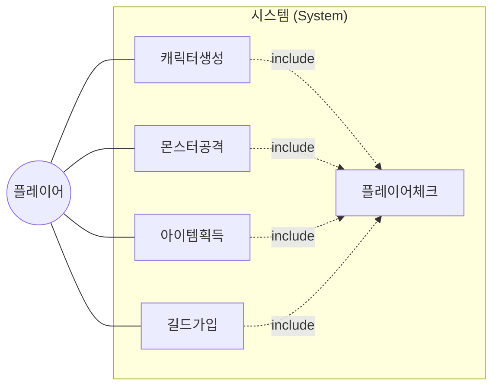

```mermaid
graph LR
    %% 액터 설정
    Player((플레이어))

    %% 시스템 경계 및 유스케이스
    subgraph "시스템 (System)"
        UC1[캐릭터생성]
        UC2[몬스터공격]
        UC3[아이템획득]
        UC4[길드가입]
        UC_Check[플레이어체크]
    end

    %% 관계 설정
    Player --- UC1
    Player --- UC2
    Player --- UC3
    Player --- UC4

    %% Include 관계 (점선 화살표)
    UC1 -.->|include| UC_Check
    UC2 -.->|include| UC_Check
    UC3 -.->|include| UC_Check
    UC4 -.->|include| UC_Check
```