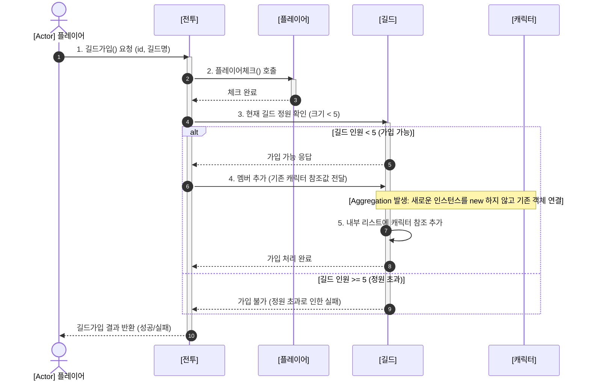

```mermaid
sequenceDiagram
    autonumber
    actor Player as [Actor] 플레이어
    participant Battle as [전투]
    participant User as [플레이어]
    participant Guild as [길드]
    participant Char as [캐릭터]

    %% UI를 거치지 않고 액터가 바로 [전투] 객체로 요청 (image_6c9048.jpg 반영)
    Player->>Battle: 1. 길드가입() 요청 (id, 길드명)
    activate Battle

    Battle->>User: 2. 플레이어체크() 호출
    activate User
    User-->>Battle: 체크 완료
    deactivate User

    %% 설계서의 최대 5명 정원 제약조건 조건문(alt)으로 결합
    Battle->>Guild: 3. 현재 길드 정원 확인 (크기 < 5)
    activate Guild
    
    alt 길드 인원 < 5 (가입 가능)
        Guild-->>Battle: 가입 가능 응답
        
        %% Aggregation의 핵심: 기존 캐릭터의 참조값을 전달
        Battle->>Guild: 4. 멤버 추가 (기존 캐릭터 참조값 전달)
        
        Note over Guild, Char: [Aggregation 발생: 새로운 인스턴스를 new 하지 않고 기존 객체 연결]
        Guild->>Guild: 5. 내부 리스트에 캐릭터 참조 추가
        
        Guild-->>Battle: 가입 처리 완료
    else 길드 인원 >= 5 (정원 초과)
        Guild-->>Battle: 가입 불가 (정원 초과로 인한 실패)
    end
    deactivate Guild

    Battle-->>Player: 길드가입 결과 반환 (성공/실패)
    deactivate Battle
```