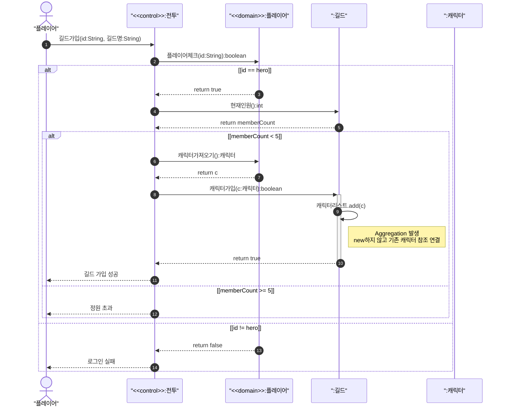

```mermaid
sequenceDiagram
    autonumber
    actor Player as "플레이어"
    participant ctrl as "<<control>>:전투"
    participant p as "<<domain>>:플레이어"
    participant g as ":길드"
    participant c as ":캐릭터"

    Player->>ctrl: 길드가입(id:String, 길드명:String)
    ctrl->>p: 플레이어체크(id:String):boolean

    alt [id == hero]
        p-->>ctrl: return true
        ctrl->>g: 현재인원():int
        g-->>ctrl: return memberCount

        alt [memberCount < 5]
            ctrl->>p: 캐릭터가져오기():캐릭터
            p-->>ctrl: return c
            ctrl->>+g: 캐릭터가입(c:캐릭터):boolean
            g->>g: 캐릭터리스트.add(c)
            note right of g: Aggregation 발생<br/>new하지 않고 기존 캐릭터 참조 연결
            g-->>-ctrl: return true
            ctrl-->>Player: 길드 가입 성공
        else [memberCount >= 5]
            ctrl-->>Player: 정원 초과
        end
    else [id != hero]
        p-->>ctrl: return false
        ctrl-->>Player: 로그인 실패
    end
```
