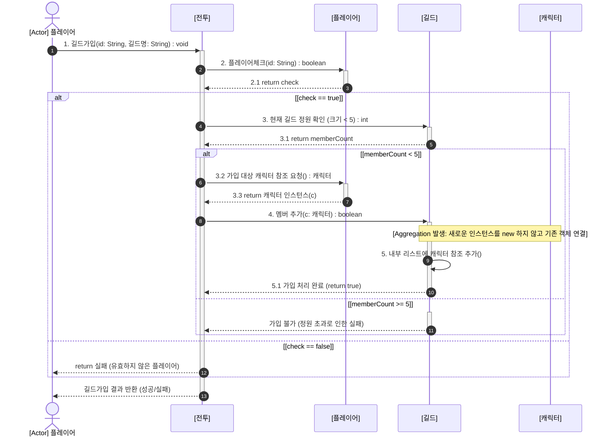

```mermaid
sequenceDiagram
    autonumber
    actor Player as [Actor] 플레이어
    participant Battle as [전투]
    participant User as [플레이어]
    participant Guild as [길드]
    participant Char as [캐릭터]

    %% 1. 요청 매개변수 타입 구체화 및 활성화(+)
    Player->>+Battle: 1. 길드가입(id: String, 길드명: String) : void
    
    %% 2. 피드백이 반영된 매개변수 및 명확한 return 구조
    Battle->>+User: 2. 플레이어체크(id: String) : boolean
    User-->>-Battle: 2.1 return check

    alt [check == true]
        %% 3. Guild 객체 활성화(+)
        Battle->>+Guild: 3. 현재 길드 정원 확인 (크기 < 5) : int
        Guild-->>-Battle: 3.1 return memberCount
        
        alt [memberCount < 5]
            %% Aggregation 특성을 명시하기 위해 기존 캐릭터 참조를 가져오는 흐름 표현
            Battle->>+User: 3.2 가입 대상 캐릭터 참조 요청() : 캐릭터
            User-->>-Battle: 3.3 return 캐릭터 인스턴스(c)
            
            %% 4. 멤버 추가 메시지 포맷 수정 및 Guild 재활성화
            Battle->>+Guild: 4. 멤버 추가(c: 캐릭터) : boolean
            
            %% 5. Aggregation 발생 명시 및 자체 순환 메시지
            Note over Guild, Char: [Aggregation 발생: 새로운 인스턴스를 new 하지 않고 기존 객체 연결]
            Guild->>Guild: 5. 내부 리스트에 캐릭터 참조 추가()
            
            Guild-->>-Battle: 5.1 가입 처리 완료 (return true)
            
        else [memberCount >= 5]
            %% 정원 초과 시 Guild 임시 활성화 후 실패 반환
            activate Guild
            Guild-->>-Battle: 가입 불가 (정원 초과로 인한 실패)
        end
        
    else [check == false]
        Battle-->>Player: return 실패 (유효하지 않은 플레이어)
    end

    %% 모든 작업 완료 후 Battle 비활성화(-)하며 결과 반환
    Battle-->>-Player: 길드가입 결과 반환 (성공/실패)
```