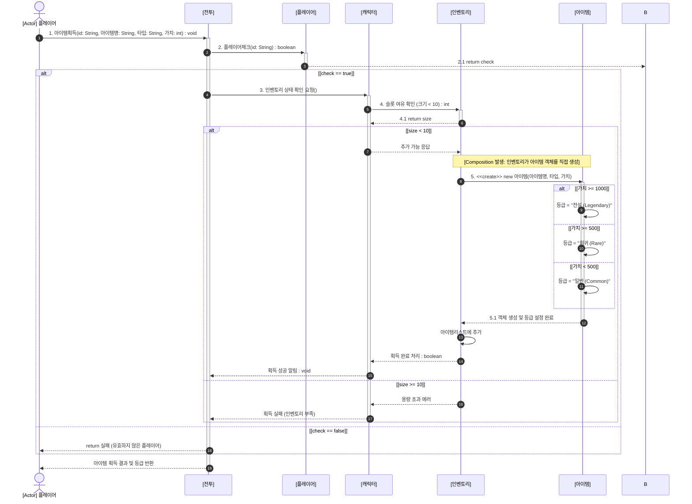

```mermaid
sequenceDiagram
    autonumber
    actor Player as [Actor] 플레이어
    participant Battle as [전투]
    participant User as [플레이어]
    participant Char as [캐릭터]
    participant Inv as [인벤토리]
    participant Item as [아이템]

    %% 1. 요청 매개변수 타입 구체화
    Player->>+Battle: 1. 아이템획득(id: String, 아이템명: String, 타입: String, 가치: int) : void
    
    %% 2. 피드백 주신대로 id 매개변수 명시 및 리턴값 추가
    Battle->>+User: 2. 플레이어체크(id: String) : boolean
    User-->>-B: 2.1 return check
    
    alt [check == true]
        Battle->>+Char: 3. 인벤토리 상태 확인 요청()
        
        Char->>+Inv: 4. 슬롯 여유 확인 (크기 < 10) : int
        Inv-->>-Char: 4.1 return size
        
        alt [size < 10]
            Char-->>Inv: 추가 가능 응답
            
            Note over Inv, Item: [Composition 발생: 인벤토리가 아이템 객체를 직접 생성]
            %% 5. 인벤토리가 아이템 생성자 호출 형태 명시
            Inv->>Item: 5. <<create>> new 아이템(아이템명, 타입, 가치)
            activate Item
            
            %% 아이템 객체 내부에서 실행되는 가치 판별 조건문 표기법 수정
            alt [가치 >= 1000]
                Item->>Item: 등급 = "전설 (Legendary)"
            else [가치 >= 500]
                Item->>Item: 등급 = "희귀 (Rare)"
            else [가치 < 500]
                Item->>Item: 등급 = "일반 (Common)"
            end
            
            Item-->>Inv: 5.1 객체 생성 및 등급 설정 완료
            deactivate Item
            
            Inv->>Inv: 아이템리스트에 추가
            
            Inv-->>Char: 획득 완료 처리 : boolean
            Char-->>Battle: 획득 성공 알림 : void
            
        else [size >= 10]
            Inv-->>Char: 용량 초과 에러
            Char-->>Battle: 획득 실패 (인벤토리 부족)
        end
        deactivate Char
        
    else [check == false]
        Battle-->>Player: return 실패 (유효하지 않은 플레이어)
    end
    
    Battle-->>-Player: 아이템 획득 결과 및 등급 반환
```