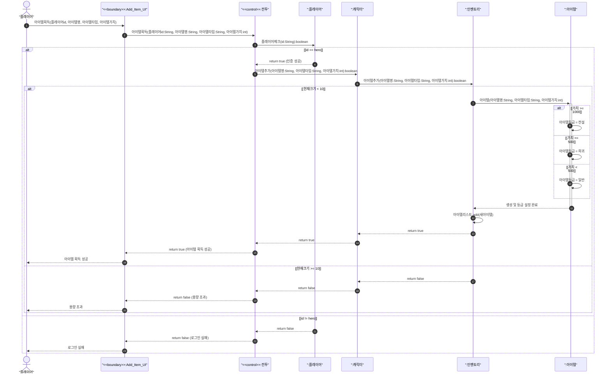

```mermaid
sequenceDiagram
    autonumber
    actor Player as "플레이어"
    participant UI as "<<boundary>>:Add_Item_UI"
    participant ctrl as "<<control>>:전투"
    participant p as ":플레이어"
    participant c as ":캐릭터"
    participant inv as ":인벤토리"
    participant item as ":아이템"

    Player->>UI: 아이템획득(플레이어id, 아이템명, 아이템타입, 아이템가치)
    UI->>ctrl: 아이템획득(플레이어id:String, 아이템명:String, 아이템타입:String, 아이템가치:int)
    ctrl->>p: 플레이어체크(id:String):boolean

    alt [id == hero]
        p-->>ctrl: return true (인증 성공)
        ctrl->>c: 아이템추가(아이템명:String, 아이템타입:String, 아이템가치:int):boolean
        c->>inv: 아이템추가(아이템명:String, 아이템타입:String, 아이템가치:int):boolean

        alt [현재크기 < 10]
            inv->>+item: 아이템(아이템명:String, 아이템타입:String, 아이템가치:int)
            alt [가치 >= 1000]
                item->>item: 아이템등급 = 전설
            else [가치 >= 500]
                item->>item: 아이템등급 = 희귀
            else [가치 < 500]
                item->>item: 아이템등급 = 일반
            end
            item-->>-inv: 생성 및 등급 설정 완료
            inv->>inv: 아이템리스트.add(새아이템)
            inv-->>c: return true
            c-->>ctrl: return true 
            ctrl-->>UI: return true (아이템 획득 성공)
            UI-->>Player: 아이템 획득 성공
        else [현재크기 >= 10]
            inv-->>c: return false
            c-->>ctrl: return false
            ctrl-->>UI: return false (용량 초과)
            UI-->>Player: 용량 초과
        end
    else [id != hero]
        p-->>ctrl: return false
        ctrl-->>UI: return false (로그인 실패)
        UI-->>Player: 로그인 실패
    end
```
