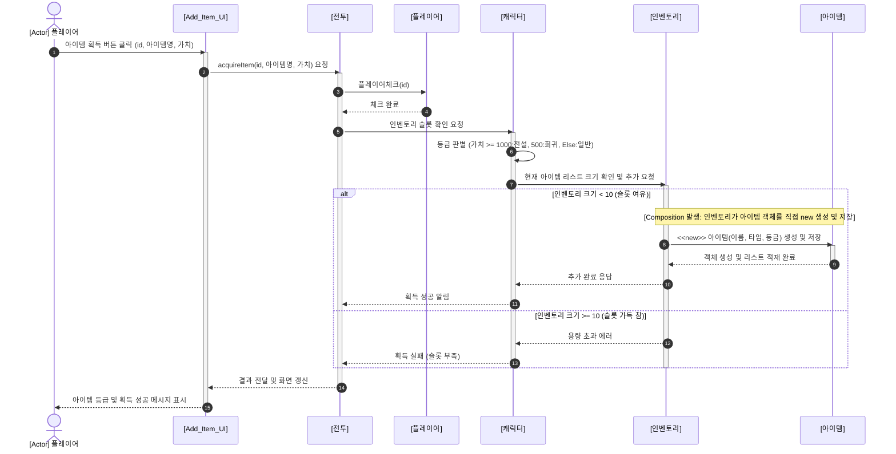

```mermaid
sequenceDiagram
    autonumber
    actor Player as [Actor] 플레이어
    participant UI as [Add_Item_UI]
    participant Battle as [전투]
    participant User as [플레이어]
    participant Char as [캐릭터]
    participant Inv as [인벤토리]
    participant Item as [아이템]

    Player->>UI: 아이템 획득 버튼 클릭 (id, 아이템명, 가치)
    activate UI
    UI->>Battle: acquireItem(id, 아이템명, 가치) 요청
    activate Battle

    Battle->>User: 플레이어체크(id)
    User-->>Battle: 체크 완료

    Battle->>Char: 인벤토리 슬롯 확인 요청
    activate Char
    
    %% 등급 판별은 설계서 조건에 따라 캐릭터가 수행
    Char->>Char: 등급 판별 (가치 >= 1000:전설, 500:희귀, Else:일반)

    Char->>Inv: 현재 아이템 리스트 크기 확인 및 추가 요청
    activate Inv
    
    alt 인벤토리 크기 < 10 (슬롯 여유)
        %% 교수님 힌트(image_6c902c.jpg) 5번 흐름 반영: 인벤토리가 직접 new 생성
        Note over Inv, Item: [Composition 발생: 인벤토리가 아이템 객체를 직접 new 생성 및 저장]
        Inv->>Item: <<new>> 아이템(이름, 타입, 등급) 생성 및 저장
        activate Item
        Item-->>Inv: 객체 생성 및 리스트 적재 완료
        deactivate Item

        Inv-->>Char: 추가 완료 응답
        Char-->>Battle: 획득 성공 알림
    else 인벤토리 크기 >= 10 (슬롯 가득 참)
        Inv-->>Char: 용량 초과 에러
        Char-->>Battle: 획득 실패 (슬롯 부족)
    end
    deactivate Inv
    deactivate Char

    Battle-->>UI: 결과 전달 및 화면 갱신
    deactivate Battle
    UI-->>Player: 아이템 등급 및 획득 성공 메시지 표시
    deactivate UI
```